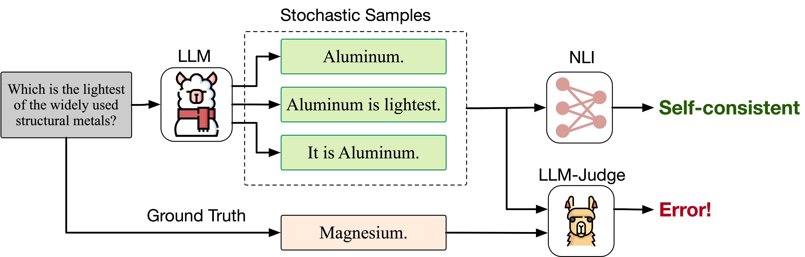

# Too Consistent to Detect: A Study of Self-Consistent Errors in LLMs

Official code for the **EMNLP 2025 main paper** 📄 ["Too Consistent to Detect: A Study of Self-Consistent Errors in LLMs"](https://arxiv.org/abs/2505.17656). We reveal a critical problem of LLMs, **Self-consistent errors (SCEs)**, where LLMs repeatedly generate the same error.
- Their frequency stays stable or even **increases** as models scale.  
- They are **hard to detect** for current error detection methods.

**This repo provide:**
- 🧩 Curated dataset of **Self-consistent errors**, and matched correct, inconsistent error samples.  
- 🔍 A simple yet effective **cross-model probe** to improve the detection of self-consistent errors.


<p align="center">
  
  <br>
</p>


---

## Environment, Data, and Models

### Install
```bash
pip install -r requirements.txt
````

### Download the SCE dataset

* Google Drive (pre-built): **[link](https://drive.google.com/drive/folders/15EPDBtECAMHZfP4Gio8Mj3Io7iUjxiIm?usp=sharing)**
* Includes SCE splits constructed for `llama3.1-8b-instruct` and `Qwen2.5-8b-instruct`.
* For each subset (CE / IE), the sample count is **matched** for fair comparison.
  * `correct.jsonl` contains the correct responses.
  * `consistent_incorrect.jsonl` contains self-consistent errors
  * `inconsistent_incorrect.jsonl` contains inconsistent errors.


### Models
We use Qwen2.5-14B-Instruct as the verifier in the paper, and you can replace it with any other models.
* **Response model** (produces answers & hidden states):[Llama-3.1-8B-Instruct](https://huggingface.co/meta-llama/Llama-3.1-8B-Instruct)
* **Verifier model** (provides cross signals via hidden states):[Qwen2.5-14B-Instruct](https://huggingface.co/Qwen/Qwen2.5-14B-Instruct)

## Quick Start: Cross-Model Probe

```bash
python3 code/cross-model_probe.py \
  --dataset sciq-ce \
  --response_model llama3.1-8b \
  --response_model_path /path/to/the/model \
  --verifier qwen2.5-14b \
  --verifier_path /path/to/the/model \
  --method probe \
  --seed 42 \
  --data_dir /your/data/dir/full-self-consistent-dataset \
  --save_dir /path/you/want/to/save
```

---

## Explanation: What the Cross-Model Probe Does?

1. **Extract hidden states** from for each example from:
   * the **response model** (e.g., Llama-3.1-8B-Instruct), and
   * the **verifier model** (e.g., Qwen2.5-14B-Instruct).
2. **Train a lightweight probe** (including selecting the best layer to use) **separately** on each model’s hidden representation to predict correctness vs. error.
3. **Fuse** the two probe scores with a scalar **λ** chosen on a dev set:
   [
   s_{\text{fused}} = \lambda \cdot s_{\text{verifier}} + (1 - \lambda) \cdot s_{\text{response}}
   ]

**Implementation note:** The core code lives in `cross-model_probe.py` (around lines **351–379**): it fits two probes (one per model’s hidden states) and **searches λ** to maximize dev performance before reporting test results.


### Command-Line Arguments

* `--dataset`: Which subset to run on (e.g., `triviaqa-ce`, `sciq-ce`, `triviaqa-ie`, `sciq-ie`).
* `--data_dir`: Root folder of the downloaded SCE dataset.
* `--response_model`: Shorthand name (e.g., `llama3.1-8b`).
* `--response_model_path`: Local path to the response model weights.
* `--verifier`: Shorthand name (e.g., `qwen2.5-14b`).
* `--verifier_path`: Local path to the verifier model weights.
* `--method`: Set to `probe` to enable the cross-model probe pipeline.
* `--seed`: Random seed for reproducibility.
* `--save_dir`: Output directory for logs, metrics, and artifacts.

---

## Citation

If you find this work useful, please cite:

```bibtex
@misc{tan2025consistentdetectstudyselfconsistent,
      title={Too Consistent to Detect: A Study of Self-Consistent Errors in LLMs}, 
      author={Hexiang Tan and Fei Sun and Sha Liu and Du Su and Qi Cao and Xin Chen and Jingang Wang and Xunliang Cai and Yuanzhuo Wang and Huawei Shen and Xueqi Cheng},
      year={2025},
      eprint={2505.17656},
      archivePrefix={arXiv},
      primaryClass={cs.CL},
      url={https://arxiv.org/abs/2505.17656}, 
}
```
